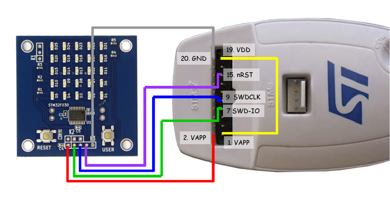
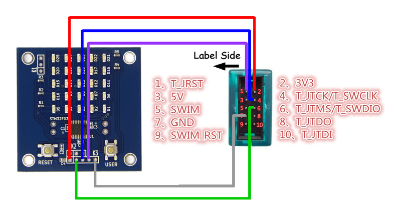

# ATS programing using Chopstx 

## Hardware specification

## Setup build environment

### [Debian GNU/Linux](https://www.debian.org/)

T.B.D.

### Windows

T.B.D.

### Mac OS X

T.B.D.

## How to build

T.B.D.

## How to write firmware

T.B.D.

## How to connect FSM-55 board and debugger

### [STMicroelectronics - ST-LINK/V2](http://www.st.com/web/en/catalog/tools/PF251168)

### [BAITE - ST-LINK V2](http://www.aliexpress.com/item/Free-Shipping-1SET-ST-Link-st-link-V2-for-STM8S-STM8L-STM32-Cortex-M0-Cortex-M3/1619197946.html)

