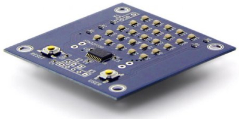

# ATS programing using Chopstx 

## Hardware specification

* MCU: [STM32F030F4P6](http://www.st.com/web/catalog/mmc/FM141/SC1169/SS1574/LN1826/PF258968)
* Flash ROM: 16kB
* SRAM: 4kB
* Battery: CR2032
* External port K1: PF0 (GPIO, connected to USER button), PF1 (GPIO), GND
* External port K2: PB1 (GPIO/TIMER/ADC), GND, VDD
* [PCB design](http://git.gniibe.org/gitweb/?p=fsm-55.git;a=summary) ([kicad](http://www.kicad-pcb.org))

You can buy it at [Seeed](http://www.seeedstudio.com/depot/FSM55-LED-Matrix-Display-p-2121.html).

## Setup build environment

### [Debian GNU/Linux](https://www.debian.org/)

T.B.D.

### Windows

T.B.D.

### Mac OS X

T.B.D.

## How to build

T.B.D.

## How to write firmware

T.B.D.

## How to connect FSM-55 board and debugger

### [STMicroelectronics - ST-LINK/V2](http://www.st.com/web/en/catalog/tools/PF251168)

### [BAITE - ST-LINK V2](http://www.aliexpress.com/item/Free-Shipping-1SET-ST-Link-st-link-V2-for-STM8S-STM8L-STM32-Cortex-M0-Cortex-M3/1619197946.html)

