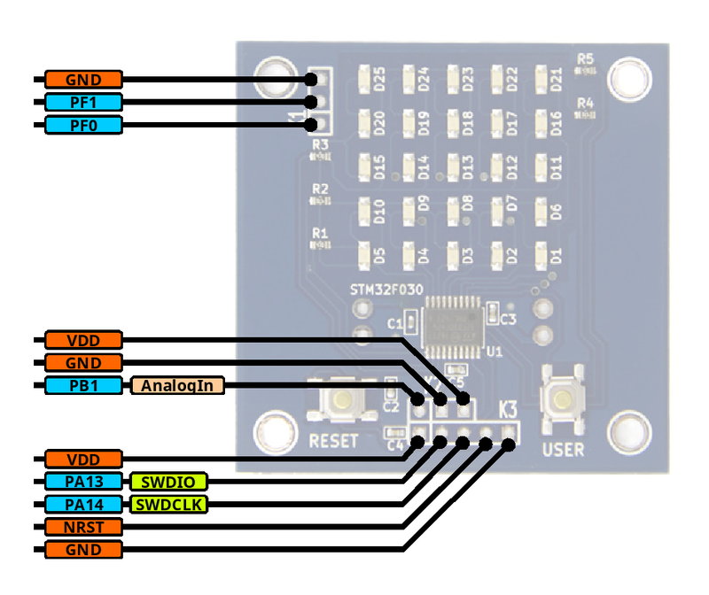
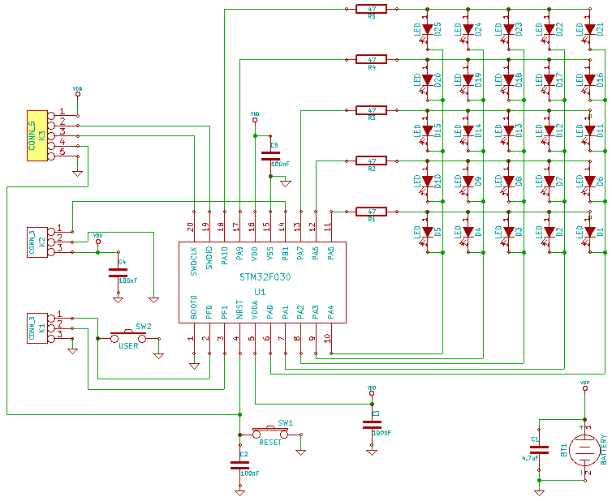

# ATS programing on Chopstx [](https://travis-ci.org/fpiot/chopstx-ats)

## What is Chopstx

See [original README](README) and [original git repository](http://git.gniibe.org/gitweb/?p=chopstx/chopstx.git;a=summary).

## Hardware specification




* MCU: [STM32F030F4P6](http://www.st.com/web/catalog/mmc/FM141/SC1169/SS1574/LN1826/PF258968)
* Flash ROM: 16kB
* SRAM: 4kB
* Battery: CR2032
* External port K1: PF0 (GPIO, connected to USER button), PF1 (GPIO), GND
* External port K2: PB1 (GPIO/TIMER/ADC), GND, VDD
* [PCB design](http://git.gniibe.org/gitweb/?p=fsm-55.git;a=summary) ([kicad](http://www.kicad-pcb.org))

You can [buy it at Seeedstudio](http://www.seeedstudio.com/depot/FSM55-LED-Matrix-Display-p-2121.html), or [make your own FSM-55 board on PCB](metasepi/doc/MakePCB.md).

## Setup build environment

### [Debian GNU/Linux](https://www.debian.org/)

T.B.D.

### Windows

T.B.D.

### Mac OS X

T.B.D.

1. Install [Xcode](https://developer.apple.com/xcode/).
2. Install [Homebrew](http://brew.sh/).
3. Download [ATS2 (ATS/Postiats)](http://www.ats-lang.org/), and build it.

```
$ brew install ats2-postiats
```

4. Install [OpenOCD](http://openocd.sourceforge.net/).

```
$ brew install openocd
```

5. Install [GNU Tools for ARM Embedded Processors](https://launchpad.net/gcc-arm
-embedded).

```
$ cd /usr/local
$ sudo tar xf ~/Downloads/gcc-arm-none-eabi-4_9-2014q4-20141203-mac.tar.bz2 
$ export PATH=$PATH:/usr/local/gcc-arm-none-eabi-4_9-2014q4/bin
```

## How to build

```
$ git clone https://github.com/fpiot/chopstx-ats.git
$ cd chopstx-ats/example-fsm-55-ats
$ make
```

## How to write firmware

Connect FSM-55 board and debugger.
See [following](#how-to-connect-fsm-55-board-and-debugger) for detail.

```
$ cd chopstx-ats/example-fsm-55-ats
$ sudo make write
```

## How to connect FSM-55 board and debugger

### [STMicroelectronics - ST-LINK/V2](http://www.st.com/web/en/catalog/tools/PF251168)


### [BAITE - ST-LINK V2](http://www.aliexpress.com/item/Free-Shipping-1SET-ST-Link-st-link-V2-for-STM8S-STM8L-STM32-Cortex-M0-Cortex-M3/1619197946.html)


## License

### Under "metasepi" directory

Copyright (c) 2014 [Metasepi team](http://www.metasepi.org/).

It is distributed under GNU General Public Licence version 2 or later (GPLv2+).
Please see ["metasepi/COPYING"](metasepi/COPYING).

### The others

Copyright (c) 2013 [Flying Stone Technology](http://www.gniibe.org/).

It is distributed under GNU General Public Licence version 3 or later (GPLv3+),
with additional permission.
Please see ["COPYING"](COPYING) and ["EXCEPTION"](EXCEPTION).
