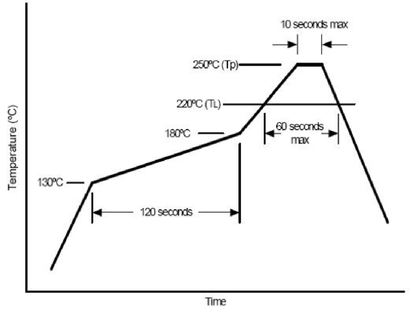

# Make your own FSM-55 board on PCB

## 1. Make gerber file on [kicad](http://www.kicad-pcb.org/)

Download kicad files.

```
$ git clone git://git.gniibe.org/fsm-55.git
```

Open "fsm-55/fsm-55.pro" file with kicad application. And make gerber file on kicad. Please see following links for the detail.

* [Kicad Tutorial: Gerber file generation | Wayne and Layne](https://www.wayneandlayne.com/blog/2013/02/27/kicad-tutorial-gerber-file-generation/)
* [ガーバーデータ出力方法「KiCad」 | プリント基板ネット通販P板.com](http://www.p-ban.com/gerber/kicad.html)

Then you can get a zip file such like following that is needed to order PCB and stencil.

```
$ unzip -l fsm-55-gerb.zip
Archive:  fsm-55-gerb.zip
  Length      Date    Time    Name
---------  ---------- -----   ----
     9815  2014-10-08 16:32   fsm-55-gerb/fsm-55-B_Mask.gbs
     3055  2014-10-08 16:32   fsm-55-gerb/fsm-55-B_SilkS.gbo
    20840  2014-10-08 16:32   fsm-55-gerb/fsm-55-Back.gbl
      413  2014-10-08 16:32   fsm-55-gerb/fsm-55-Edge_Cuts.gbr
    20613  2014-10-08 16:32   fsm-55-gerb/fsm-55-F_Mask.gts
    75053  2014-10-08 16:32   fsm-55-gerb/fsm-55-F_SilkS.gto
    44306  2014-10-08 16:32   fsm-55-gerb/fsm-55-Front.gtl
      364  2014-10-08 16:35   fsm-55-gerb/fsm-55-drl.rpt
    22772  2014-10-08 16:35   fsm-55-gerb/fsm-55-drl_map.pho
      652  2014-10-08 16:35   fsm-55-gerb/fsm-55.drl
---------                     -------
   197883                     10 files
```

## 2. Order PCB

Order PCB at [2 Layer 5 * 5cm Max - 5/10pcs (Color Free) [SPF20505S] - $9.90 : Elecrow bazaar](http://www.elecrow.com/2-layer-5-5cm-max-510pcs-color-free-p-418.html).

## 3. Order stencil

Order stencil at [Laser Cut PCB Stencil service without frame [SPS30121S] - $16.00 : Elecrow bazaar](http://www.elecrow.com/laser-cut-pcb-stencil-service-without-frame-p-869.html).

## 4. Order the other parts

* [MCU: STM32F030F4P6](http://www.aliexpress.com/w/wholesale-STM32F030F4P6.html) - $0.50
* [Cell battery holder: BAT-HLD-001-THM](http://www.mouser.jp/ProductDetail/Linx-Technologies/BAT-HLD-001-THM/?Linx-Technologies%2fBAT-HLD-001-THM%2f&qs=sGAEpiMZZMtT9MhkajLHrtLdadThLjMV00SR3w%2f8BL4%3d) - $0.28
* [LED: LG R971-KN-1](http://www.mouser.jp/ProductDetail/Osram-Opto-Semiconductor/LG-R971-KN-1/?Osram-Opto-Semiconductor%2fLG-R971-KN-1%2f&qs=%2fha2pyFaduhGIbxpHp5T4KdFZX%2fz3gP6qixqD3%2flaOb8MwcpKKfsGw%3d%3d) - $0.061 x 25
* [Tactile switch: SKQGAFE010](http://www.mouser.jp/ProductDetail/ALPS/SKQGAFE010/?ALPS%2fSKQGAFE010%2f&qs=%2fha2pyFadugelz7Lz2BJTQJWaWETzWHvv1Y2jLsd4zo%3d) - $0.73 x 2
* [Resistor 47Ω](http://www.mouser.jp/ProductDetail/Vishay-Dale/CRCW080547R0JNEA/?Vishay-Dale%2fCRCW080547R0JNEA%2f&qs=sGAEpiMZZMvdGkrng054txEw7b1YnvGuFYxJnz1RVXQ%3d) - $0.08 x 5
* [Capacitor 4.7uF](http://www.mouser.jp/ProductDetail/Vishay-Vitramon/VJ0805V475ZXQTW1BC/?qs=sGAEpiMZZMuMW9TJLBQkXmt5SQVoUrSJNAU8zZEgNqU%3d) - $0.06
* [Capacitor 100nF (0.1uF)](http://www.mouser.jp/ProductDetail/Vishay-Vitramon/VJ0603Y104JXQCW1BC/?Vishay-Vitramon%2fVJ0603Y104JXQCW1BC%2f&qs=sGAEpiMZZMuMW9TJLBQkXvlFzI1aRBtdrU1srwol6I4%3d) - $0.06 x 4
* [Pin header 2.54mm 1x5](http://www.mouser.jp/ProductDetail/Amphenol-Commercial-Products/G800MR303018E0/?qs=sGAEpiMZZMs%252bGHln7q6pm41Noaw7hCiyu9cuXCdBwDY%3d) - $0.21
* [Solder paste](http://www.aliexpress.com/wholesale?SearchText=solder+paste+xg-50) - $4.27

## 5. Tools needed for assembly

* Absolute ethanol
* Electric hot plate ([YAMAZEN HG-T1301 - $17.00](http://kakaku.com/item/K0000643271/))
* Magnifier
* ST-LINK V2 ([BAITE brand - $6.90](http://www.aliexpress.com/item/Free-Shipping-1SET-ST-Link-st-link-V2-for-STM8S-STM8L-STM32-Cortex-M0-Cortex-M3/1619197946.html))
* Scotch tape
* Squeegee
* Tweezers

## 6. Assembly ([Reflow soldering](http://en.wikipedia.org/wiki/Reflow_soldering))

[](http://www.youtube.com/watch?v=prjB_myCwSY)



xxx T.B.D. xxx

Please see following links for the detail.

* [電子工作勉強中: 自宅リフローに挑戦しました：失敗事例集と要点](http://benkyo-chu.blogspot.jp/2014/05/12.html)
* [ホットプレートを使ってリフローはんだづけにチャレンジ！ - Togetterまとめ](http://togetter.com/li/542601)
